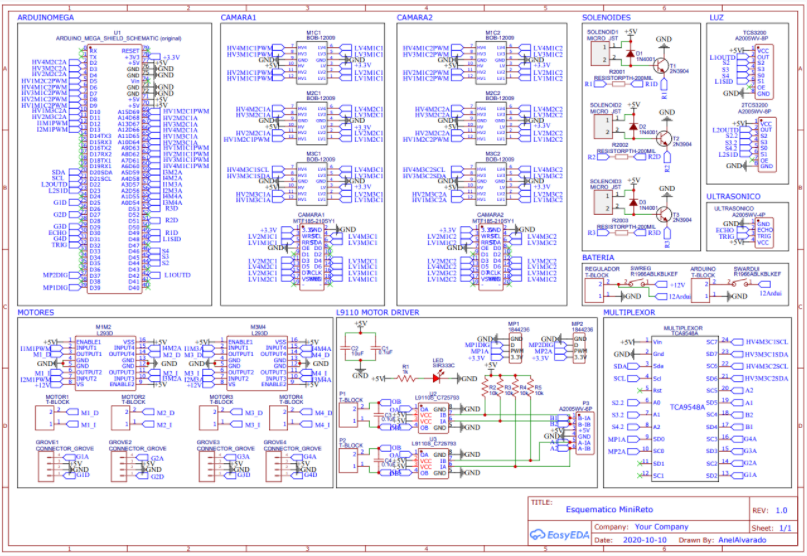

# Title

## Overview

### Actual state
### Functionality

## Requirements and electrical components

Sofware for PCB design, microcontrollers, etc.

## PCB Modules
 Block diagram, abstract components
### Power sourcing
### Control
Logics circuit microcontroller
### Connections
Ports

## Schematic

## (Optional) Connection with other modules/systems

## Additional modifications and improvements

## Reference and support links

