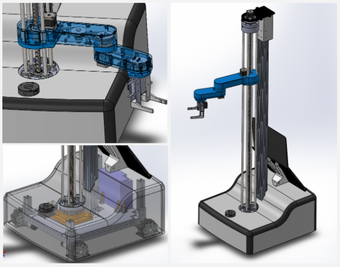

# Mechanics

## Mechanisms
#### The documentation of every important mechanism designed for a Roboregos proyect must follow this basic structure:
###  Title    
### Overview
   * Actual state
      > Description of the final sate the develpment reached.
    * Functionality
      > Description of the intended function of the mechanism.

### Requirements
*  Software used
	> List the different software used for the design and testing of the mechanism.

	*	CAD
	*	CAE*
*  Materials used

### Electromechanic component #n
>The following information must be provided for **every** electromechanic component of the mechanism. 
* Sensor/Actuator
	* Location
	* Cabling routes*

### Important Mechanism/Piece #n
> The following information must be provided for **every** piece of the mechanism
*  Overview
	*  Actual state 
	*  Functionality
* Material description
*  Machining process   
*  Dimensions
*  IMAGES

### Performance
*  Performance during testing
*  Performance during competition*
### Additional modifications and improvements
* Modifications*
	>Modifications made during develpment that are not accounted in the CAD model
*  Suggestions for further improvements
### References & Support links
#
##### * Include only if it applies to the project.
