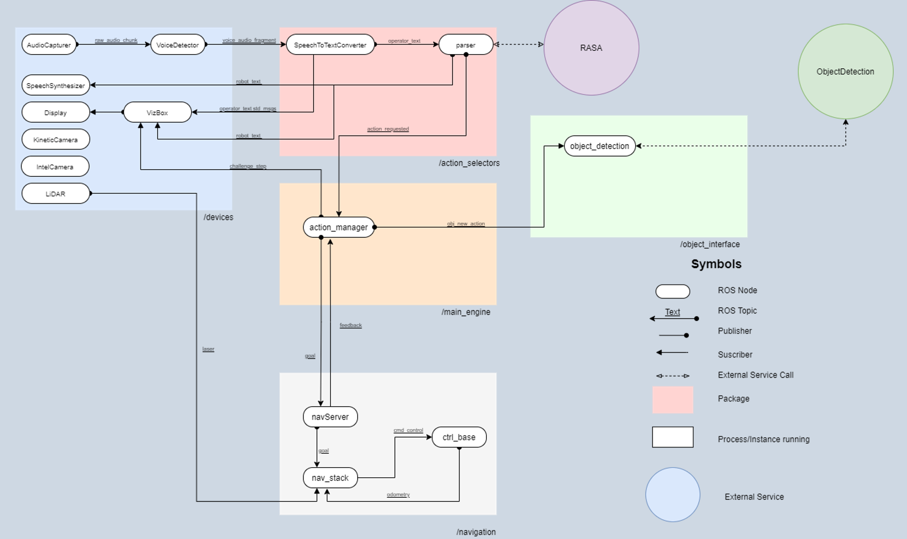

# RoBorregos [Project Name]
This repository contains the development of RoBorregos' robotic solution for [RoboCup's @HOME competition](https://athome.robocup.org/), Open Platform League (OPL), where the robot must be capable of interacting with people, manipulate objects and have intelligent responses for everyday home tasks.

See [RoboCup @HOME Rules](https://robocupathome.github.io/RuleBook/rulebook/master.pdf).

## Project details

This project is made using:
- [ROS Melodic](https://www.ros.org/)
- [Rasa NLU](https://rasa.com/)
- [Tensorflow](https://www.tensorflow.org/learn)
- [PaddlePaddle](https://github.com/paddlepaddle/paddle)
- [Arduino](https://www.arduino.cc/)
- [VIA EPIA](https://www.viatech.com/en/support/eol/epia-eol/)
- [Jetson](https://developer.nvidia.com/EMBEDDED/jetson-nano-developer-kit)

 

For more information about the project system, structure, and development areas you can check our [Official Documentation](https://github.com/RoBorregos/Robocup-Home/wiki).

### Development team

| Name                    | Email                                                               | Github                                                       | Role      |
| ----------------------- | ------------------------------------------------------------------- | ------------------------------------------------------------ | --------- |
| Aurora Tijerina | [auro.tj@gmail.com](mailto:auro.tj@gmail.com) | [@AuroTB](https://github.com/aurotb) | Navigation & Integration |
| Brenda Guadalupe Martínez Orta | [bmaor2001@gmail.com](mailto:bmaor2001@gmail.com) | [@bmaor2001](https://github.com/bmaor2001) | Result data decoding |
| Keven Arroyo | [dake.3601@gmail.com](mailto:dake.3601@gmail.com) | [@dake3601](https://github.com/dake3601) | Path finding |
| Ivan Sol | [onticastro7@gmail.com](mailto:onticastro7@gmail.com) | [@IvanSol123](https://github.com/IvanSol123) | Mechanics |
